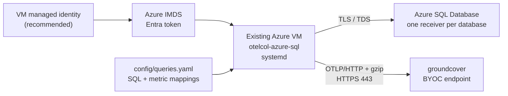

# Azure SQL metrics for groundcover

This package installs `otelcol-azure-sql` as a systemd service on an **existing
Azure VM**. It runs the SQL in `config/queries.yaml` against Azure SQL Database,
maps numeric result columns to OpenTelemetry metrics, and sends them to
groundcover over OTLP/HTTP.

This package supports **Azure SQL Database only**. It does not target SQL Server
on a VM or Azure SQL Managed Instance.

## Architecture



The collector uses Microsoft's pure-Go `go-mssqldb` driver. **No ODBC runtime is
required** by the service.

## Choose an authentication profile

Recommended: managed identity

- Uses the VM's system-assigned managed identity (SAMI) or a user-assigned
  managed identity (UAMI).
- Stores no SQL password on the VM.
- Requires this project's patched `otelcol-azure-sql` binary. Stock
  `otelcol-contrib` 0.158.0 rejects `driver: azuresql` and does not import the
  `azuread` driver package.

Fallback: SQL username and password

- Uses stock `otelcol-contrib` 0.158.0 with `driver: sqlserver`.
- Supports the same query-to-metric-to-groundcover path, but stores a database
  credential in the root-readable environment file.

Explicit compatibility answers:

- Standard `otelcol-contrib` for managed identity: **NO**.
- Standard `otelcol-contrib` for SQL username/password: **YES**.
- Host the custom release in GitHub Releases: **YES**.
- Use this same repository for source and release artifacts: **YES**.

Do not configure `driver: sqlserver` with `fedauth`; that driver does not enable
managed identity. See [Azure managed identity](docs/azure-managed-identity.md).

## Collector components

The custom distribution intentionally contains only:

- patched `sqlqueryreceiver`
- `otlphttpexporter` and temporary `debugexporter`
- `memory_limiter`, `resource`, and `batch` processors
- `health_check` extension
- `env` and `file` configuration providers

The stock SQL-auth profile uses the same configured components from the official
`otelcol-contrib` distribution. The service does not require ODBC, an OTLP
receiver, host metrics, or custom query-execution code.

## Prerequisites

- An existing Linux Azure VM with systemd and outbound HTTPS.
- Azure SQL Database reachable from that VM using
  `<server>.database.windows.net`.
- For managed identity, a SAMI or UAMI assigned to the VM and an Entra admin
  configured for the Azure SQL logical server.
- A least-privilege SQL principal in every database being scraped. Templates are
  under `sql/`.
- A groundcover OTLP/HTTP **base URL**, including `https://` but excluding
  `/v1/metrics`, and a **Third Party** ingestion key.
- Root access on the VM.
- Access to this package's published releases at
  `johndexteriv/otelcol-azure-sql`.

The groundcover exporter uses port `443`, puts the Third Party ingestion key in
the `apikey` header, and supplies `env_name`, `service.name`, `gc_env_type`, and
`source` attribution. The exporter appends `/v1/metrics` to the base URL.

## Quick start

Run these commands **on the existing VM**, from a checkout or release bundle of
this repository. The installer is local; it does not SSH from a laptop or create
Azure resources.

```bash
cp config/env.example config/env
chmod 600 config/env
$EDITOR config/env
$EDITOR config/queries.yaml

sudo ./install/install.sh --profile managed-identity
sudo ./install/validate.sh
```

Maintainers can validate an unpublished build on a VM without changing the
customer release path:

```bash
sudo ./install/install.sh \
  --profile managed-identity \
  --binary ./collector-builder/dist/otelcol-azure-sql
```

For the stock SQL-auth fallback:

```bash
# First enable the documented sqlserver connection block in config/queries.yaml.
sudo ./install/install.sh --profile sql-auth
sudo ./install/validate.sh
```

Before installing, create the database user and grants described in
[Azure managed identity](docs/azure-managed-identity.md). For private networking,
complete the DNS and routing checks in [Networking](docs/networking.md).

## Configuration

Customer-edited files:

- `config/env` — endpoint, key, identity selection, attribution, fallback SQL
  credentials, release pin, and collection interval. Never commit this file.
- `config/queries.yaml` — the only location for customer SQL and native
  `sqlquery` metric mappings; it also holds non-secret server/database names.

The package also installs `config/collector.yaml` (the shared pipeline) and
`config/debug.yaml` (a temporary debug override). Customers normally do not edit
those two files.

Important values in `config/env`:

```dotenv
GROUNDCOVER_OTLP_ENDPOINT=https://<byoc-endpoint>
GROUNDCOVER_INGESTION_KEY=<third-party-ingestion-key>
GROUNDCOVER_ENV_NAME=<environment>
GROUNDCOVER_SERVICE_NAME=azure-sql-custom-metrics
AZURE_MANAGED_IDENTITY_CLIENT_ID=
SQL_USERNAME=<sql-auth-fallback-user>
SQL_PASSWORD=<sql-auth-fallback-password>
SQL_COLLECTION_INTERVAL=60s
COLLECTOR_RELEASE_REPOSITORY=johndexteriv/otelcol-azure-sql
```

Replace the SQL server and database placeholders in `config/queries.yaml`. For
UAMI, set `AZURE_MANAGED_IDENTITY_CLIENT_ID`; leave it empty for SAMI. For SQL
auth, enable the documented `sqlserver` connection block in
`config/queries.yaml` and set the least-privilege username/password. The shared
collector config sets `gc_env_type=vm` and `source=otel-collector`. Quote and
escape environment values exactly as directed by `config/env.example`.

## Queries and metrics

The supplied query intent is:

1. Activity-batch backlog summary: nine gauges.
2. Per-tenant backlog: four gauges labeled by `databaseid`.
3. Azure SQL backup health: nine gauges labeled by database.

The pending-age buckets are cumulative. Backup age uses `999999` when a backup
type has never occurred, so stale-backup alerts fail safe. The backup query reads
`sys.dm_database_backups`, which is Azure SQL Database-specific.

groundcover stores Prometheus-compatible names. Expect dots to become
underscores; metrics with unit `1` can receive a `_ratio` suffix. For example:

- `activity_batch.pending` → `activity_batch_pending`
- `activity_batch_tenants.pending` → `activity_batch_tenants_pending`
- `azure_sql_backups.last_full_age_hours` →
  `azure_sql_backups_last_full_age_hours`
- `azure_sql_backups.has_full_backup_last_7d` →
  `azure_sql_backups_has_full_backup_last_7d_ratio`

See [Adding custom queries](docs/adding-custom-queries.md) for the native schema,
complete metric list, and change workflow.

## Multiple databases

Use one named native `sqlquery` receiver per database in `config/queries.yaml`.
Azure SQL databases are isolated,
and `sys.dm_database_backups` is scoped to the connected database; one connection
cannot collect backup rows for every database on the logical server.

- For a database with the application schema, reuse all three anchored queries.
- For a database without that schema, reuse only
  `*query_azure_sql_backups`.
- Add every receiver ID to `service.pipelines.metrics.receivers`.
- Keep the query-produced `db_name` attribute so same-named metrics from
  different databases remain separate series.
- Remember that `max_open_conn` applies per receiver.

## Validation ladder

Work from the dependency closest to the VM outward:

1. **Identity:** retrieve an Azure SQL token from IMDS.
2. **DNS and TCP:** resolve the normal SQL FQDN and connect on port 1433.
3. **SQL login and grants:** connect to each database and run each query.
4. **Collector config:** run the binary's `validate` command.
5. **Service:** verify `otelcol-azure-sql` is active and not restarting.
6. **Local telemetry:** use the debug override briefly and confirm all expected
   metric families.
7. **Exporter:** confirm sent points increase while failed points remain zero.
8. **groundcover:** search by translated metric name and attribution labels.

Run the packaged checks:

```bash
sudo ./install/validate.sh
sudo systemctl status otelcol-azure-sql
sudo journalctl -u otelcol-azure-sql -n 200 --no-pager
```

See [Troubleshooting](docs/troubleshooting.md) for the exact binary validation and
debug-override commands.

## Operations

```bash
# Follow logs
sudo journalctl -u otelcol-azure-sql -f

# Apply config changes (there is no hot reload)
sudo systemctl restart otelcol-azure-sql

# Confirm service state
sudo systemctl is-active otelcol-azure-sql
sudo systemctl show otelcol-azure-sql -p NRestarts
```

Upgrade by reviewing the release notes and rerunning the same profile with the
new immutable release version. The installer preserves the installed customer
configuration by default:

```bash
sudo ./install/install.sh \
  --profile managed-identity \
  --version <UPSTREAM_VERSION>-groundcover.<PATCH_REVISION>
sudo ./install/validate.sh
```

Use `--replace-config` only when you intentionally want the repository copies
of `collector.yaml`, `queries.yaml`, `debug.yaml`, and `env` to replace the
installed files.

Keep the custom build pinned to the tested contrib base. A future stock release
must be re-evaluated before replacing the patched binary; support in 0.158.0 must
not be assumed from a newer package name alone.

Uninstall only the collector service and its installed files:

```bash
sudo ./install/uninstall.sh
```

The uninstaller does not delete the VM, database, network, managed identity, SQL
users, or groundcover keys. Revoke or remove those separately when required.

## Verify in groundcover

In groundcover Metrics, search for `activity_batch_pending`, then filter by:

- `env` from `env_name`
- `service_name` from `service.name`
- `env_type` from `gc_env_type`
- `source`
- `db_name` and, where applicable, `databaseid` or `dbname`

Allow at least two collection intervals after startup. If metrics exist in the
local debug output but not in groundcover, check HTTPS reachability, the full
base URL, the Third Party key in `apikey`, and persistent UI filters.

## Documentation and authoritative references

- [Azure managed identity and SQL permissions](docs/azure-managed-identity.md)
- [Adding custom queries](docs/adding-custom-queries.md)
- [Networking](docs/networking.md)
- [Troubleshooting](docs/troubleshooting.md)
- [OpenTelemetry SQL Query receiver](https://github.com/open-telemetry/opentelemetry-collector-contrib/tree/v0.158.0/receiver/sqlqueryreceiver)
- [OpenTelemetry Collector configuration](https://opentelemetry.io/docs/collector/configuration/)
- [Microsoft Entra service principals with Azure SQL](https://learn.microsoft.com/azure/azure-sql/database/authentication-aad-service-principal-tutorial)
- [Azure SQL connectivity architecture](https://learn.microsoft.com/azure/azure-sql/database/connectivity-architecture)
- [groundcover: sending from an OpenTelemetry Collector](https://docs.groundcover.com/integrations/data-sources/opentelemetry/sending-from-an-opentelemetry-collector)
- [groundcover ingestion keys](https://docs.groundcover.com/use-groundcover/remote-access-and-apis/ingestion-keys)
- [Custom Collector releases](https://github.com/johndexteriv/otelcol-azure-sql/releases)
