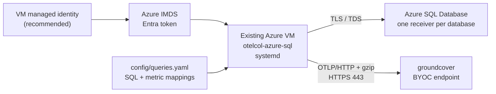

# Azure SQL metrics for groundcover

This package installs `otelcol-azure-sql` as a systemd service on an **existing
Azure VM**. It runs the SQL in `config/queries.yaml` against Azure SQL Database,
maps numeric result columns to OpenTelemetry metrics, and sends them to
groundcover over OTLP/HTTP.

This package supports **Azure SQL Database only**. It does not target SQL Server
on a VM or Azure SQL Managed Instance.

New here? Go to [Installation](#installation) and work through the eleven steps in
order. Everything after that section is reference material.

Evaluating rather than deploying? `scripts/provision-azure-test-env.sh` builds a
disposable VM, logical server, and two databases with the Azure CLI, so you can
run the installation steps against throwaway resources first.

## Before you begin

Have these in place:

- An existing Linux Azure VM with systemd and outbound HTTPS. `git`, `curl`, and
  `nc` are present on the standard Ubuntu and Debian Azure images. The installer
  can install its own missing dependencies **only** on Ubuntu and Debian; on any
  other distribution it stops and names what is missing.
- Root access on the VM.
- Azure SQL Database reachable from that VM using
  `<server>.database.windows.net`. If the logical server uses public network
  access, its firewall needs a rule for the VM's outbound public IP. The
  operator host that runs steps 1-3 needs its own rule.
- An Entra admin configured for the Azure SQL logical server. Steps 1-3 create the
  identity and its database principals.
- An `az login` session on the operator host, signed in as an Entra principal
  that is the logical server's Entra administrator, so it holds `ALTER ANY USER`.
- **Go `sqlcmd`** on the operator host, version 1.x
  ([install](https://github.com/microsoft/go-sqlcmd)). The older ODBC `sqlcmd`
  rejects `--authentication-method`, which every command in step 3 uses.
- Access to this package's published releases at
  `johndexteriv/otelcol-azure-sql`.

Collect these values before step 7:

- The groundcover OTLP/HTTP **base URL**, including `https://` but excluding
  `/v1/metrics`.
- A groundcover **Third Party** ingestion key.
- An environment name and a service name for attribution.
- The Azure SQL logical server FQDN and the name of every database to scrape.
- For a user-assigned managed identity, its **client ID**.

The groundcover exporter uses port `443`, puts the Third Party ingestion key in
the `apikey` header, and supplies `env_name`, `service.name`, `gc_env_type`, and
`source` attribution. The exporter appends `/v1/metrics` to the base URL.

Installation documents the recommended managed-identity profile. To use a SQL
username and password instead, read
[Appendix: SQL username and password fallback](#appendix-sql-username-and-password-fallback)
before you start.

### Required application schema

The supplied queries are not all self-contained. 13 of the 22 metrics come from
two application tables that this package does not create:

- `customer.ActivityRecordBatchInformation` with `Id`, `TenancyId`,
  `UploadDateTime`, `InsertDateTime`, and `FailedInsertAttempts`.
- `customer.Tenancy` with `Id`, `Reference`, and `ParentTenantId`.

A database without the `customer` schema can still report the nine
`azure_sql_backups` metrics; see [Multiple databases](#multiple-databases) for
the backups-only receiver shape. To exercise the full metric set on a scratch
database, `sql/test-fixtures/seed-customer-schema.sql` creates these tables and
seeds rows spanning every age bucket. It is a test fixture; never run it against
a real application database.

## Installation

Steps 1-3 and step 5 are Azure-side and groundcover-side preparation. Run them
from any host that has the Azure CLI, `sqlcmd`, and a checkout of this repository
for the `sql/` templates. Step 4 and steps 6-11 run **on the existing VM**. The
installer is local; it does not SSH from a laptop or create Azure resources.

### 1. Assign a managed identity to the VM

For a system-assigned managed identity (SAMI):

```bash
az vm identity assign \
  --resource-group <vm-resource-group> \
  --name <vm-name>
```

The SAMI display name matches the VM resource name. For a user-assigned managed
identity (UAMI), assign it instead and record its **client ID** for
`AZURE_MANAGED_IDENTITY_CLIENT_ID` in step 7. Do not substitute the
principal/object ID.

The client ID is not what step 3 wants. `principal_name` there is always the
identity's **display name**: the VM resource name for a SAMI, or the managed
identity's own resource name for a UAMI. The client ID appears only in
`config/env` and in the step 4 IMDS check.

See [Azure managed identity](docs/azure-managed-identity.md) for both variants.

### 2. Confirm Entra authentication on the logical server

Azure RBAC controls management-plane actions only. It does not grant permission to
connect to a database or run `SELECT`. The logical server needs Microsoft Entra
authentication configured, and you need an Entra principal with `ALTER ANY USER`
to complete step 3.

See [Azure RBAC is not SQL permission](docs/azure-managed-identity.md#azure-rbac-is-not-sql-permission).

### 3. Create the SQL user and grants in every target database

Run these from the operator host, connected as the logical server's Entra
administrator. **Order matters**, so work through 3a and 3b in sequence.

Both commands use `-b`, which makes `sqlcmd` exit non-zero on a SQL error.
Without `-b`, a failed `CREATE LOGIN` or `CREATE USER` still exits 0 and prints
an empty result set, so a broken grant looks like a success.

#### 3a. Restricted tiers only: grant the server role first

Skip this only if every target database is S2 or higher. On Basic, S0, S1, and
elastic-pool databases the backup DMV requires `##MS_ServerStateReader##`, which
is granted in virtual `master`:

```bash
principal_name=<MANAGED_IDENTITY_DISPLAY_NAME> \
sqlcmd -b \
  -S <SQL_SERVER_FQDN> \
  -d master \
  --authentication-method ActiveDirectoryDefault \
  -i sql/grant-server-state-reader.sql
```

Run this **before** 3b. `sql/create-managed-identity-user.sql` maps the database
user to this login when the login already exists; if you create the database user
first, a later `master` grant does not remap it. Recovering from that ordering
mistake means `DROP USER` in the affected database and rerunning 3b.

If this command reports `Msg 40602 Could not create login. Please try again
later.`, Azure is throttling login creation. Wait a minute and rerun it; the
script is safe to repeat.

#### 3b. Every target database: create the user and grants

Run this once per database that a receiver will scrape:

```bash
principal_name=<MANAGED_IDENTITY_DISPLAY_NAME> \
sqlcmd -b \
  -S <SQL_SERVER_FQDN> \
  -d <SQL_DATABASE> \
  --authentication-method ActiveDirectoryDefault \
  -i sql/create-managed-identity-user.sql
```

`principal_name` is the identity **display name** from step 1, not its client ID.

The script grants `SELECT ON SCHEMA::customer` only when that schema already
exists. On a database where the application schema is created later, rerun 3b
afterwards to pick up the grant; the script is idempotent and skips the user it
already created.

Contained users are database-scoped, so repeat 3b in every target database,
including backup-only databases. See the
[backup DMV permission matrix](docs/azure-managed-identity.md#backup-dmv-permission-matrix).

### 4. Confirm the network path from the VM

Run these **on the VM**. Substitute your own values:

```bash
SQL_FQDN=<server>.database.windows.net
GC_HOST=exampleendpoint.grcv.io

nslookup "$SQL_FQDN"
nc -vz -w 5 "$SQL_FQDN" 1433
nc -vz -w 5 "$GC_HOST" 443
```

Then confirm the VM can mint an Azure SQL token from IMDS. For a
**system-assigned** identity:

```bash
curl --fail --silent --show-error --noproxy '*' \
  -H 'Metadata: true' \
  'http://169.254.169.254/metadata/identity/oauth2/token?api-version=2018-02-01&resource=https%3A%2F%2Fdatabase.windows.net%2F' \
  >/dev/null && echo 'IMDS token acquired'
```

For a **user-assigned** identity, append `&client_id=` so the check exercises the
identity the collector will actually use. Without it, IMDS returns a token for a
different identity on the VM and the check passes while the collector still fails
to log in:

```bash
curl --fail --silent --show-error --noproxy '*' \
  -H 'Metadata: true' \
  'http://169.254.169.254/metadata/identity/oauth2/token?api-version=2018-02-01&resource=https%3A%2F%2Fdatabase.windows.net%2F&client_id=<UAMI_CLIENT_ID>' \
  >/dev/null && echo 'IMDS token acquired'
```

`install/validate.sh` builds the same URL and adds `client_id` automatically from
`AZURE_MANAGED_IDENTITY_CLIENT_ID`.

Always configure the normal SQL FQDN, never an IP address and never
`privatelink.database.windows.net`. `nc` proves a TCP handshake only. For private
endpoints, Redirect port ranges, and proxy caveats, complete the checks in
[Networking](docs/networking.md).

### 5. Get the groundcover endpoint and ingestion key

Take the BYOC base URL and a **Third Party** ingestion key from the groundcover
ingestion keys screen. Keep the base URL free of `/v1/metrics`; the exporter
appends that path itself. See
[groundcover ingestion keys](https://docs.groundcover.com/use-groundcover/remote-access-and-apis/ingestion-keys).

### 6. Put this repository on the VM

The installer, the `config/` templates, and the `sql/` templates all ship in the
repository, so the VM needs the repository itself:

```bash
git clone https://github.com/johndexteriv/otelcol-azure-sql.git
cd otelcol-azure-sql
```

Run every remaining command from that directory.

If the VM cannot reach GitHub over `git`, use the release's **Source code
(tar.gz)** archive, which contains the same tree. Do not use the
`otelcol-azure-sql_<version>_linux_<arch>.tar.gz` asset for this step: it holds
only the collector binary, with no `install/`, `config/`, or `sql/` directory.
The installer downloads that binary asset itself in step 9.

### 7. Create and complete `config/env`

```bash
cp config/env.example config/env
chmod 600 config/env
nano config/env   # or vi, or any editor
```

`$EDITOR` is unset on a stock Azure Ubuntu image, so name the editor explicitly.

The installer refuses to proceed unless `config/env` is a regular file with no
group or other permissions, readable by its owner, and free of unresolved
placeholders. `chmod 600` satisfies the permission check. Set these four required
values:

- `GROUNDCOVER_OTLP_ENDPOINT`
- `GROUNDCOVER_INGESTION_KEY`
- `GROUNDCOVER_ENV_NAME`
- `GROUNDCOVER_SERVICE_NAME`

Then handle the identity and fallback lines:

- Set `AZURE_MANAGED_IDENTITY_CLIENT_ID` to the UAMI client ID, or leave it empty
  for a SAMI.
- **Clear the values of `SQL_USERNAME` and `SQL_PASSWORD`.** They ship as
  `<SQL_READER_USERNAME>` and `<SQL_READER_PASSWORD>` placeholders, and the
  managed-identity install aborts while they are still present. Leave the keys
  themselves in place with empty values, or comment out both lines.

Leave `COLLECTOR_PROFILE=managed-identity` as shipped. Quote and escape values
exactly as directed by `config/env.example`. Never commit this file.

### 8. Replace the placeholders in `config/queries.yaml`

```bash
nano config/queries.yaml
```

Replace `<SQL_SERVER_FQDN>` and `<SQL_DATABASE>` in the `sqlquery/primary`
`datasource` line. The installer scans every active line of `config/env`,
`collector.yaml`, `queries.yaml`, and `debug.yaml` and aborts on any remaining
`<NAME>` placeholder, so this edit is mandatory. Placeholders inside commented
lines are ignored, so the commented example receivers can stay as shipped.

To scrape more than one database, add a receiver per database now and follow
[Multiple databases](#multiple-databases).

### 9. Install the service

```bash
sudo ./install/install.sh --profile managed-identity
```

The installer verifies the release checksum, creates the `otelcol-azure-sql`
service account, installs the configuration into `/etc/otelcol-azure-sql`,
validates the collector configuration, then enables and starts the service and
waits for its health endpoint.

`/etc/otelcol-azure-sql/` is the live configuration from this point on. The
service reads `env`, `collector.yaml`, and `queries.yaml` from there, not from
your checkout. Editing `config/` afterwards changes nothing until you rerun the
installer with `--replace-config`, because a rerun preserves the installed files
by default.

### 10. Validate the installation

```bash
sudo ./install/validate.sh
```

This is a read-only diagnostic ladder. It ends with a
`N pass, N warning, N fail` summary. A warning that Go `sqlcmd` is absent is
expected and harmless; the script never installs it. If a rung fails, see
[Validation ladder](#validation-ladder) for what that rung does and does not
prove, and [Troubleshooting](docs/troubleshooting.md) for the repair commands.

### 11. Verify in groundcover

In groundcover Metrics, search for `activity_batch_pending`, then filter by any
of these labels:

- `env` and `env_name`, both carrying `GROUNDCOVER_ENV_NAME`
- `service_name` from `service.name`
- `gc_env_type`, which is `vm`
- `source`, which is `otel-collector`
- `db_name`, and `databaseid` or `dbname` where the query supplies them
- `sql_server_name`

The label is `gc_env_type`; it is not renamed to `env_type` on ingestion.

Allow at least two collection intervals after startup. If metrics exist in the
local debug output but not in groundcover, check HTTPS reachability, the full
base URL, the Third Party key in `apikey`, and persistent UI filters.

## Architecture



The collector uses Microsoft's pure-Go `go-mssqldb` driver. **No ODBC runtime is
required** by the service.

## Collector components

The custom distribution intentionally contains only:

- patched `sqlqueryreceiver`
- `otlphttpexporter` and temporary `debugexporter`
- `memory_limiter`, `resource`, and `batch` processors
- `health_check` extension
- `env` and `file` configuration providers

The stock SQL-auth profile uses the same configured components from the official
`otelcol-contrib` distribution. The service does not require ODBC, an OTLP
receiver, host metrics, or custom query-execution code.

## Configuration reference

Customer-edited files:

- `config/env` — endpoint, key, identity selection, attribution, fallback SQL
  credentials, release pin, and collection interval. Never commit this file.
- `config/queries.yaml` — the only location for customer SQL and native
  `sqlquery` metric mappings; it also holds non-secret server/database names.

The package also installs `config/collector.yaml` (the shared pipeline) and
`config/debug.yaml` (a temporary debug override). Customers normally do not edit
those two files.

Important values in `config/env`:

```dotenv
GROUNDCOVER_OTLP_ENDPOINT=https://exampleendpoint.grcv.io
GROUNDCOVER_INGESTION_KEY=<third-party-ingestion-key>
GROUNDCOVER_ENV_NAME=<environment>
GROUNDCOVER_SERVICE_NAME=azure-sql-custom-metrics
AZURE_MANAGED_IDENTITY_CLIENT_ID=
SQL_USERNAME=<sql-auth-fallback-user>
SQL_PASSWORD=<sql-auth-fallback-password>
SQL_COLLECTION_INTERVAL=60s
COLLECTOR_RELEASE_REPOSITORY=johndexteriv/otelcol-azure-sql
```

Replace the SQL server and database placeholders in `config/queries.yaml`. For
UAMI, set `AZURE_MANAGED_IDENTITY_CLIENT_ID`; leave it empty for SAMI. For SQL
auth, enable the documented `sqlserver` connection block in
`config/queries.yaml` and set the least-privilege username/password. The shared
collector config sets `gc_env_type=vm` and `source=otel-collector`. Quote and
escape environment values exactly as directed by `config/env.example`.

The profile can be selected two ways, and `--profile` wins. `COLLECTOR_PROFILE`
in `config/env` applies only when the flag is omitted, and the same precedence
applies to `CUSTOM_COLLECTOR_VERSION`/`STOCK_COLLECTOR_VERSION` against
`--version`. Keep both settings consistent so the intent stays obvious.

## Queries and metrics

The supplied query intent is:

1. Activity-batch backlog summary: nine gauges.
2. Per-tenant backlog: four gauges labeled by `databaseid`.
3. Azure SQL backup health: nine gauges labeled by database.

The pending-age buckets are cumulative. Backup age uses `999999` when a backup
type has never occurred, so stale-backup alerts fail safe. The backup query reads
`sys.dm_database_backups`, which is Azure SQL Database-specific.

groundcover stores Prometheus-compatible names. Expect dots to become
underscores; metrics with unit `1` can receive a `_ratio` suffix. For example:

- `activity_batch.pending` → `activity_batch_pending`
- `activity_batch_tenants.pending` → `activity_batch_tenants_pending`
- `azure_sql_backups.last_full_age_hours` →
  `azure_sql_backups_last_full_age_hours`
- `azure_sql_backups.has_full_backup_last_7d` →
  `azure_sql_backups_has_full_backup_last_7d_ratio`

See [Adding custom queries](docs/adding-custom-queries.md) for the native schema,
complete metric list, and change workflow.

## Multiple databases

Use one named native `sqlquery` receiver per database in `config/queries.yaml`.
Azure SQL databases are isolated,
and `sys.dm_database_backups` is scoped to the connected database; one connection
cannot collect backup rows for every database on the logical server.

- For a database with the application schema, reuse all three anchored queries.
- For a database without that schema, reuse only
  `*query_azure_sql_backups`.
- Add every receiver ID to `service.pipelines.metrics.receivers`, which is at the
  bottom of `config/queries.yaml`. A receiver that is defined but not listed
  there is silently never scraped.
- Keep the query-produced `db_name` attribute so same-named metrics from
  different databases remain separate series.
- Remember that `max_open_conn` applies per receiver.

`config/queries.yaml` ships `sqlquery/secondary-full` and
`sqlquery/secondary-backups` as commented templates. Uncomment one, replace its
connection placeholders, and uncomment the matching pipeline entry.

The YAML anchors (`&query_...`) are defined on `sqlquery/primary`. If you reduce
`sqlquery/primary` to a backups-only database by deleting the other two query
blocks, their anchors disappear and no other receiver can reference them. Keep
the database that has the application schema as `sqlquery/primary`.

Every database added here also needs its own SQL principal and grants from
step 3.

## Validation ladder

`install/validate.sh` works from the dependency closest to the VM outward. It is
read-only and never restarts the service.

What the script checks automatically:

1. **Installation and profile:** unit file, binary, installed config files,
   environment-file ownership and mode, no unresolved placeholders, and that the
   active receiver drivers match the recorded profile.
2. **Identity:** retrieve an Azure SQL token from IMDS, adding `client_id` when
   `AZURE_MANAGED_IDENTITY_CLIENT_ID` is set. Skipped for `sql-auth`.
3. **DNS and TCP:** resolve the SQL FQDN and connect on port 1433.
4. **Collector config:** run the binary's `validate` command against both
   installed config files.
5. **Service:** confirm the unit is enabled, active, and answering `/healthz`.
6. **Journal:** scan the recent journal for known SQL, identity, network, and
   exporter failure signatures.
7. **Exporter:** report receiver-accepted and exporter-sent point counts.

What it does **not** do. These rungs are manual:

- **SQL login and grants per database.** The optional SQL rung needs Go `sqlcmd`
  installed on the VM, which the script never installs, and even then it runs a
  single `SELECT DB_NAME()` against one host. It never iterates your databases
  and never executes the real queries. To prove a specific database, connect to
  it and run the query from `config/queries.yaml` yourself.
- **Local telemetry inspection.** The script does not load `config/debug.yaml`.
  Use the debug helper for that, after stopping the service:

  ```bash
  sudo systemctl stop otelcol-azure-sql
  sudo /usr/local/sbin/otelcol-azure-sql-debug   # Ctrl-C when finished
  sudo systemctl start otelcol-azure-sql
  ```

- **groundcover.** The script has no groundcover credentials and never queries
  the API. Confirm arrival in the UI as in step 11.

Run the packaged checks:

```bash
sudo ./install/validate.sh
sudo systemctl status otelcol-azure-sql
sudo journalctl -u otelcol-azure-sql -n 200 --no-pager
```

See [Troubleshooting](docs/troubleshooting.md) for the exact binary validation and
debug-override commands.

## Operations

```bash
# Follow logs
sudo journalctl -u otelcol-azure-sql -f

# Apply config changes (there is no hot reload)
sudo systemctl restart otelcol-azure-sql

# Confirm service state
sudo systemctl is-active otelcol-azure-sql
sudo systemctl show otelcol-azure-sql -p NRestarts
```

Upgrade by reviewing the release notes and rerunning the same profile with the
new immutable release version. The installer preserves the installed customer
configuration by default:

```bash
sudo ./install/install.sh \
  --profile managed-identity \
  --version <UPSTREAM_VERSION>-groundcover.<PATCH_REVISION>
sudo ./install/validate.sh
```

Use `--replace-config` only when you intentionally want the repository copies
of `collector.yaml`, `queries.yaml`, `debug.yaml`, and `env` to replace the
installed files.

Keep the custom build pinned to the tested contrib base. A future stock release
must be re-evaluated before replacing the patched binary; support in 0.158.0 must
not be assumed from a newer package name alone.

Maintainers can validate an unpublished build on a VM without changing the
customer release path:

```bash
sudo ./install/install.sh \
  --profile managed-identity \
  --binary ./collector-builder/dist/otelcol-azure-sql
```

Uninstall the collector service, its binary, and the debug helper:

```bash
sudo ./install/uninstall.sh
```

By default this **preserves** `/etc/otelcol-azure-sql/` — including `env` with
your ingestion key — and keeps the locked `otelcol-azure-sql` service account, so
a later reinstall reuses them. To remove the configuration directory and the
service account as well:

```bash
sudo ./install/uninstall.sh --purge-config
```

Neither form deletes the VM, database, network, managed identity, SQL users, or
groundcover keys. Revoke or remove those separately when required.

## Appendix: SQL username and password fallback

Use this profile only when managed identity cannot yet be deployed. It stores a
database credential in the root-readable environment file.

How the two profiles differ:

- **Managed identity (recommended)** uses the VM's SAMI or UAMI, stores no SQL
  password on the VM, and requires this project's patched `otelcol-azure-sql`
  binary. Stock `otelcol-contrib` 0.158.0 rejects `driver: azuresql` and does not
  import the `azuread` driver package.
- **SQL username and password** uses stock `otelcol-contrib` 0.158.0 with
  `driver: sqlserver`. It supports the same query-to-metric-to-groundcover path.

Explicit compatibility answers:

- Standard `otelcol-contrib` for managed identity: **NO**.
- Standard `otelcol-contrib` for SQL username/password: **YES**.
- Host the custom release in GitHub Releases: **YES**.
- Use this same repository for source and release artifacts: **YES**.

Do not configure `driver: sqlserver` with `fedauth`; that driver does not enable
managed identity. See [Azure managed identity](docs/azure-managed-identity.md).

Follow [Installation](#installation) with these changes:

- **Step 1 and step 2** are not required. No managed identity is involved.
- **Step 3:** create a SQL-authenticated user instead. Both scripts take
  `sqlcmd -v` variables, and `reader_password_sql` must be the password with
  **every single quote doubled**, because `sqlcmd` substitutes it textually into
  a quoted SQL literal. Keep the unmodified password for `config/env`.

  Authenticate as an administrator first. Either use the Entra admin as in step
  3, or export the SQL administrator credential so `sqlcmd` picks it up without
  putting it in the command line:

  ```bash
  export SQLCMDUSER=<SQL_ADMIN_USER>
  read -rs SQLCMDPASSWORD && export SQLCMDPASSWORD
  ```

  For Basic, S0, S1, or an elastic-pool database, create the server login and
  grant the server role in virtual `master` first:

  ```bash
  sqlcmd -b \
    -S <SQL_SERVER_FQDN> \
    -d master \
    -v reader_user="<SQL_READER_USER>" \
       reader_password_sql="<SQL_READER_PASSWORD_WITH_DOUBLED_QUOTES>" \
    -i sql/grant-server-state-reader-sql-auth.sql
  ```

  Then, once per target database:

  ```bash
  sqlcmd -b \
    -S <SQL_SERVER_FQDN> \
    -d <SQL_DATABASE> \
    -v reader_user="<SQL_READER_USER>" \
       reader_password_sql="<SQL_READER_PASSWORD_WITH_DOUBLED_QUOTES>" \
    -i sql/create-sql-auth-user.sql
  ```

  Azure SQL rejects a password that contains the login name, so do not derive one
  from the other. `-b` matters here: without it a rejected password prints an
  error and still exits 0.
- **Step 4:** skip the IMDS token check.
- **Step 7:** set `SQL_USERNAME` and `SQL_PASSWORD` to the least-privilege
  credential rather than clearing them, and set
  `COLLECTOR_PROFILE=sql-auth`. Leave `AZURE_MANAGED_IDENTITY_CLIENT_ID` empty. A
  password containing `'`, `"`, `$`, or `#` must be double-quoted, for example
  `SQL_PASSWORD="pa'ss#word"`.
- **Step 8:** switch the connection block of **every** active receiver. In
  `config/queries.yaml`, **delete or comment out the active `driver: azuresql`
  and `datasource:` lines**, then uncomment the documented `sqlserver` block below
  them. Leaving both drivers active fails the installer's profile compatibility
  check, and so does leaving one receiver on `azuresql`. The commented
  `sqlquery/secondary-*` templates carry only a pointer comment, so copy the
  `sqlserver` block from `sqlquery/primary` into each one by hand:

  ```yaml
  driver: sqlserver
  host: <SQL_SERVER_FQDN>
  port: 1433
  database: <SQL_DATABASE>
  username: ${env:SQL_USERNAME}
  password: ${env:SQL_PASSWORD}
  additional_params:
    encrypt: "true"
    TrustServerCertificate: "false"
  ```

- **Step 9:** install with the other profile. This downloads stock
  `otelcol-contrib` instead of the patched binary:

  ```bash
  sudo ./install/install.sh --profile sql-auth
  sudo ./install/validate.sh
  ```

For provisioning and password rotation, see
[SQL-auth fallback and rotation](docs/azure-managed-identity.md#sql-auth-fallback-and-rotation).

## Documentation and authoritative references

- [Azure managed identity and SQL permissions](docs/azure-managed-identity.md)
- [Adding custom queries](docs/adding-custom-queries.md)
- `scripts/provision-azure-test-env.sh` — disposable Azure test environment
- `sql/test-fixtures/seed-customer-schema.sql` — application schema for testing
- [Networking](docs/networking.md)
- [Troubleshooting](docs/troubleshooting.md)
- [OpenTelemetry SQL Query receiver](https://github.com/open-telemetry/opentelemetry-collector-contrib/tree/v0.158.0/receiver/sqlqueryreceiver)
- [OpenTelemetry Collector configuration](https://opentelemetry.io/docs/collector/configuration/)
- [Microsoft Entra service principals with Azure SQL](https://learn.microsoft.com/azure/azure-sql/database/authentication-aad-service-principal-tutorial)
- [Azure SQL connectivity architecture](https://learn.microsoft.com/azure/azure-sql/database/connectivity-architecture)
- [groundcover: sending from an OpenTelemetry Collector](https://docs.groundcover.com/integrations/data-sources/opentelemetry/sending-from-an-opentelemetry-collector)
- [groundcover ingestion keys](https://docs.groundcover.com/use-groundcover/remote-access-and-apis/ingestion-keys)
- [Custom Collector releases](https://github.com/johndexteriv/otelcol-azure-sql/releases)
